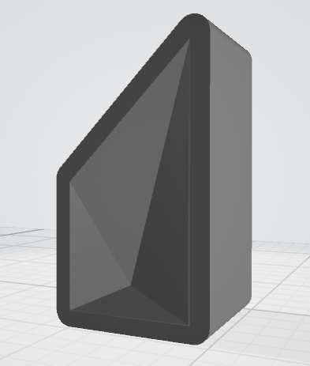
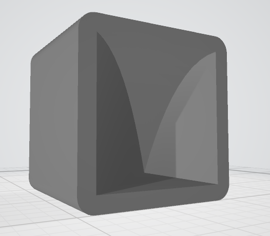
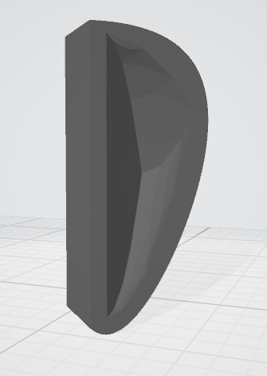
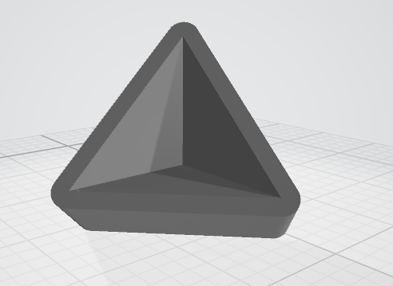
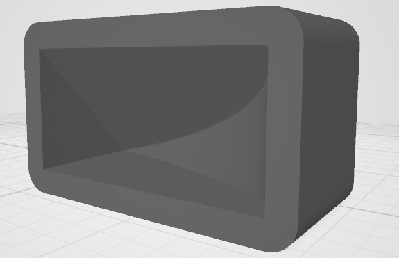

## GitHub Link

* [https://github.com/ericdbancroft/3D-prints/molds/](https://github.com/ericdbancroft/3D-prints/molds/)

## STL Files

These will need to be printed in two or more pieces in order to be able to separate the cast from the mold; we recommend splitting at the lowest point of the mold for best results. Splitting can typically be done in your printer's driver software. Ater printing you may need to do some additional sanding or chemical smoothing for a better seal of the pieces and release of the casts. You should also use a release agent, we found that a light coat of cooking spray was sufficient. When mixing your casting media such as Plaster of Paris, the fewer lumps and bubbles you have the smoother the resulting cast will be.

### [Solid 1 STL file](masters/solid1mold.stl)
  
 
  
### [Solid 2 STL file](masters/solid2mold.stl)
  
 
  
### [Solid 3 STL file](masters/solid3mold.stl)
  
 
  
### [Solid 4 STL file](masters/solid4mold.stl)
  
 
  
### [Solid 5 STL file](masters/solid5mold.stl)
  
 