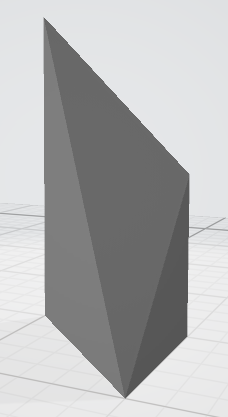
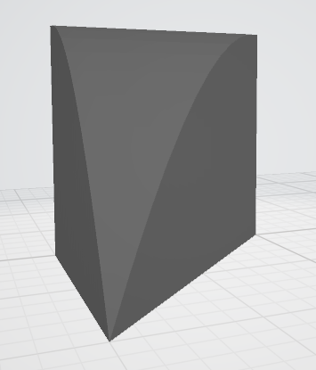
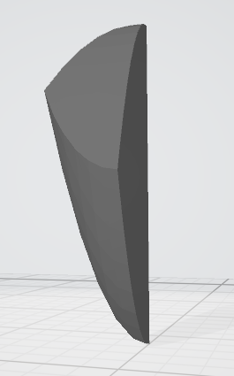
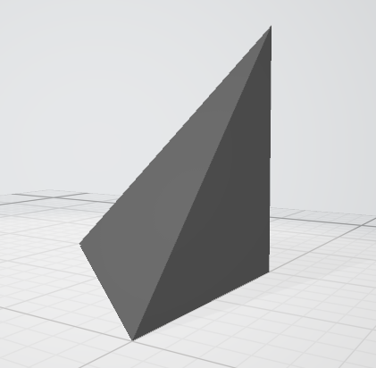
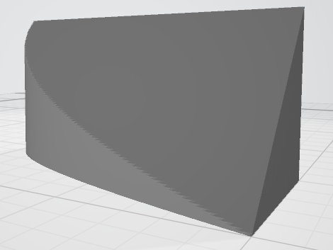

## GitHub Link

* [https://github.com/ericdbancroft/3D-prints/masters/](https://github.com/ericdbancroft/3D-prints/masters/)

## STL Files

Note: Only the full views (\(z\)-axis view) are linked here. See the folder above for additional files corresponding to split views.

### [Solid 1 STL file](masters/solid1.Zview_master.stl)
  
 
  
### [Solid 2 STL file](masters/solid2.Zview_master.stl)
  
 
  
### [Solid 3 STL file](masters/solid3.Zview_master.stl)
  
 
  
### [Solid 4 STL file](masters/solid4_master.stl)
  
 
  
### [Solid 5 STL file](masters/solid5.Zview_master.stl)
  
 